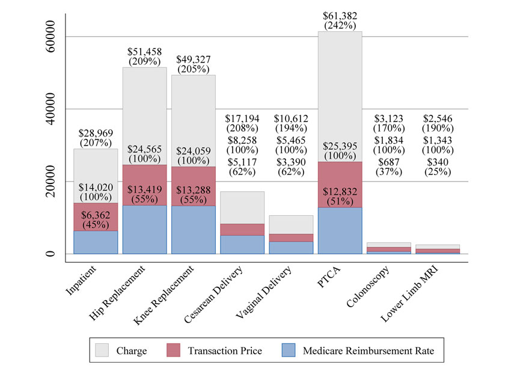

<!-- Adjust some CSS code for font size and maintain R code font size -->
<style type="text/css">
.remark-slide-content {
    font-size: 30px;
    padding: 1em 2em 1em 2em;    
}
.remark-code {
  font-size: 15px;
}
.remark-inline-code { 
    font-size: 20px;
}
</style>


<!-- Set R options for how code chunks are displayed and load packages -->
```{r setup, include=FALSE}
options(htmltools.dir.version = FALSE)
library(knitr)
knitr::opts_chunk$set(
  fig.align="center",  
  fig.height=3, #fig.width=6,
  # out.width="748px", #out.length="520.75px",
  dpi=300, #fig.path='Figs/',
  cache=T,# echo=F, warning=F, message=F
  warning = FALSE, 
  message = FALSE, 
  cache.lazy = FALSE,
  error=TRUE
  )

knitr::opts_hooks$set(fig.callout = function(options) {
  if(options$fig.callout) {
    options$echo = FALSE
  }
  options
})

if (!require("pacman")) install.packages("pacman")
pacman::p_load(tidyverse, ggplot2, dplyr, lubridate, readr, readxl, hrbrthemes,
               scales, plotly, gganimate, cobalt, MatchIt, ggthemes, here, latex2exp,
               hettreatreg)
set.seed(12345)
```

```{r xaringan-scribble, echo=FALSE}
xaringanExtra::use_scribble(rgb(0.9, 0.5, 0.5))
```


# What is a hospital price?

Defining characteristic of hospital services: *it's complicated!*

--
.center[
  
]

<div class="smalltext">Brill, Steven. 2013. "Bitter Pill: Why Medical Bills are Killing Us." *Time Magazine*.</div>

---
# What is a hospital price?

Lots of different payers paying lots of different prices:
- [Medicare fee-for-service prices](https://www.cms.gov/Outreach-and-Education/Medicare-Learning-Network-MLN/MLNProducts/Downloads/AcutePaymtSysfctsht.pdf)
- [Medicaid payments](https://www.kff.org/report-section/understanding-medicaid-hospital-payments-and-the-impact-of-recent-policy-changes-issue-brief/)
- Private insurance negotiations (including Medicare Advantage)
- But what about the price to patients?

--

.center[
Price $\neq$ charge $\neq$ cost $\neq$ patient out-of-pocket spending
]

---
# What is a hospital price?

.center[
  
]

<div class="smalltext">Source: <a href="https://healthcarepricingproject.org/">Health Care Pricing Project</a></div>


---
# What is a hospital price?
Not clear what exactly is negotiated...

--
.pull-left[
### Fee-for-service
- price per procedure
- percentage of charges
- markup over Medicare rates
]

--
.pull-right[
### Capitation
- payment per patient
- pay-for-performance
- shared savings
]

---
# Hospital prices in real life
A few empirical facts:

1. Hospital services are expensive

2. Prices vary dramatically across different areas

3. Lack of competition is a major reason for high prices

---
# Hospital prices in real life

.pull-left[
  
]

.pull-right[
  
]

<div class="smalltext">Source: <a href="https://healthcarepricingproject.org/">Health Care Pricing Project</a></div>


<!-- New Section -->
---
class: inverse, center, middle
name: hcris

# Understanding HCRIS Data

<html><div style='float:left'></div><hr color='#EB811B' size=1px width=1055px></html>


---
# What is HCRIS?
Healthcare Cost Report Information System ('cost reports')
- Nursing Homes (SNFs)
- Hospice
- Home Health Agencies
- Hospitals 

---
# Hospital Cost Reports

.center[
  
]

---
# The Data

Let's work with the [HCRIS GitHub repository](https://github.com/imccart/HCRIS). But forming the dataset is up to you this time.

--
.center[
  
]


---
# The Data
```{r eval=T, include=F}
hcris.data <- read_rds(here("data/HCRIS_Data.rds"))
```

```{r hospital-count, eval=FALSE, warning=FALSE}
hcris.data %>% 
  ggplot(aes(x=as.factor(year))) + 
  geom_bar() +
  labs(
    x="Year",
    y="Number of Hospitals",
    title="Number of Hospitals per Year"
  ) + theme_bw() +
  theme(axis.text.x = element_text(angle = 90, hjust=1))
```
.plot-callout[
```{r hospital-count-callout, ref.label="hospital-count", fig.callout=TRUE, warning=FALSE}
```
]


---
# Number of hospitals

```{r hospital-count-output, ref.label="hospital-count", fig.callout=TRUE, warning=FALSE}
```

---
# Estimating hospital prices
```{r price-calc}
hcris.data <- hcris.data %>%
  mutate( discount_factor = 1-tot_discounts/tot_charges,
          price_num = (ip_charges + icu_charges + ancillary_charges)*discount_factor - tot_mcare_payment,
          price_denom = tot_discharges - mcare_discharges,
          price = price_num/price_denom)
```

---
# Estimating hospital prices

.left-code[
```{r price-plot1, fig.show="hide"}
hcris.data %>% group_by(year) %>% 
  filter(price_denom>10, !is.na(price_denom), 
         price_num>0, !is.na(price_num)) %>%  
  select(price, year) %>% 
  summarize(mean_price=mean(price, na.rm=TRUE)) %>%
  ggplot(aes(x=as.factor(year), y=mean_price)) + 
  geom_line(aes(group=1)) +
  labs(
    x="Year",
    y="Average Hospital Price",
    title="Hospital Prices per Year"
  ) + scale_y_continuous(labels=comma) +
  theme_bw() + theme(axis.text.x = element_text(angle = 90, hjust=1))
```
]

.right-plot[
`)
]


---
# Estimating hospital prices

.left-code[
```{r price-plot2, fig.show="hide"}
hcris.data %>% group_by(year) %>% 
  filter(price_denom>100, !is.na(price_denom), 
         price_num>0, !is.na(price_num),
         price<100000) %>%   #<<
  select(price, year) %>% 
  summarize(mean_price=mean(price, na.rm=TRUE)) %>%
  ggplot(aes(x=as.factor(year), y=mean_price)) + 
  geom_line(aes(group=1)) +
  labs(
    x="Year",
    y="Average Hospital Price",
    title="Hospital Prices per Year"
  ) + scale_y_continuous(labels=comma) +
  theme_bw() + theme(axis.text.x = element_text(angle = 90, hjust=1))
```
]

.right-plot[
`)
]


