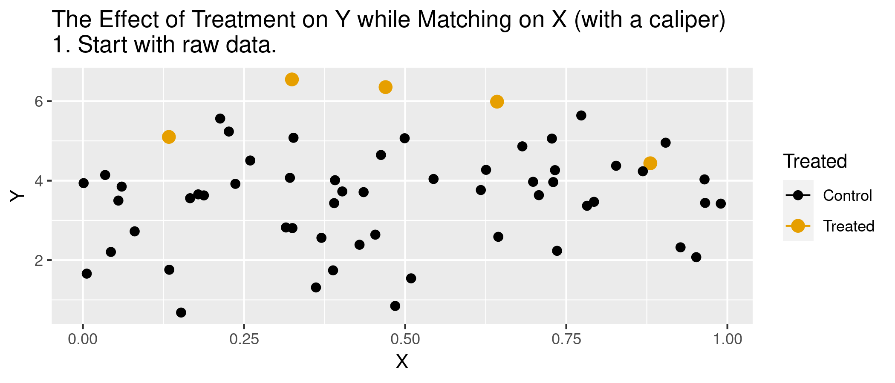
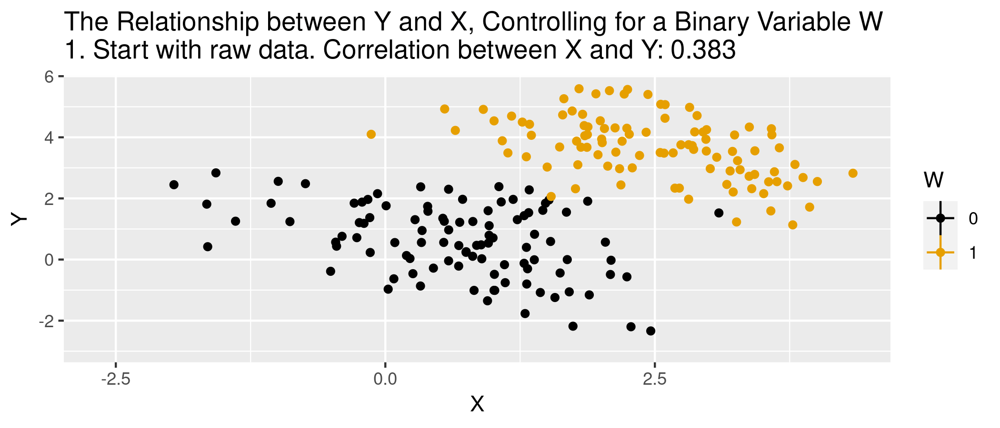

<!-- Adjust some CSS code for font size and maintain R code font size -->
<style type="text/css">
.remark-slide-content {
    font-size: 30px;
    padding: 1em 2em 1em 2em;    
}
.remark-code {
  font-size: 15px;
}
.remark-inline-code { 
    font-size: 20px;
}
</style>


<!-- Set R options for how code chunks are displayed and load packages -->
```{r setup, include=FALSE}
options(htmltools.dir.version = FALSE)
library(knitr)
knitr::opts_chunk$set(
  fig.align="center",  
  fig.height=3, #fig.width=6,
  # out.width="748px", #out.length="520.75px",
  dpi=300, #fig.path='Figs/',
  cache=T,# echo=F, warning=F, message=F
  warning = FALSE, 
  message = FALSE, 
  cache.lazy = FALSE,
  error=TRUE
  )

knitr::opts_hooks$set(fig.callout = function(options) {
  if(options$fig.callout) {
    options$echo = FALSE
  }
  options
})

if (!require("pacman")) install.packages("pacman")
pacman::p_load(tidyverse, ggplot2, dplyr, lubridate, readr, readxl, hrbrthemes,
               scales, plotly, gganimate, cobalt, MatchIt, ggthemes, here, latex2exp,
               hettreatreg)
set.seed(12345)
```

```{r xaringan-scribble, echo=FALSE}
xaringanExtra::use_scribble(rgb(0.9, 0.5, 0.5))
```


# Goal

Find covariates $X_{i}$ such that the following assumptions are plausible:


1. Selection on observables: $$Y_{0i}, Y_{1i} \perp\!\!\!\perp D_{i} | X_{i}$$
2. Common support: $$0 < \text{Pr}(D_{i}=1|X_{i}) < 1$$


--


Then we can use $X_{i}$ to group observations and use expectations for control as the predicted counterfactuals among treated, and vice versa. 


---
# Assumption 1: Selection on Observables

$E[Y_{1}|D,X]=E[Y_{1}|X]$


--


In words...nothing unobserved that determines treatment selection and affects your outcome of interest.


---
# Assumption 1: Selection on Observables

- Example of selection on observables from *Mastering Metrics*


---
# Assumption 2: Common Support
Someone of each type must be in both the treated and untreated groups

--
$$0 < \text{Pr}(D=1|X) <1$$


---
# Causal inference with observational data

With selection on observables and common support:

1. Subclassification
2. Matching estimators
3. Reweighting estimators
4. Regression estimators


---
# Subclassification

Sum the average treatment effects by group, and take a weighted average over those groups:

$$ATE=\sum_{i=1}^{N} P(X=x_{i}) \left(E[Y | X, D=1] - E[Y | X, D=0]\right)$$

---
# Subclassification

- Difference between treated and controls
- Weighted average by probability of given group (proportion of sample)
- What if outcome is unobserved for treatment or control group for a given subclass?


--

- This is the *curse of dimensionality*

---
# Matching: The process
1. For each observation $i$, find the $m$ "nearest" neighbors, $J_{m}(i)$. 
2. Impute $\hat{Y}_{0i}$ and $\hat{Y}_{1i}$ for each observation:<br>
$$\hat{Y}_{0i} = \begin{cases}
    Y_{i} & \text{if} & D_{i}=0 \\
    \frac{1}{m} \sum_{j \in J_{m}(i)} Y_{j} & \text{if} & D_{i}=1 
\end{cases}$$
$$\hat{Y}_{1i} = \begin{cases}
    Y_{i} & \text{if} & D_{i}=1 \\
    \frac{1}{m} \sum_{j \in J_{m}(i)} Y_{j} & \text{if} & D_{i}=0 
\end{cases}$$

3. Form "matched" ATE:<br>
$\hat{\delta}^{\text{match}} = \frac{1}{N} \sum_{i=1}^{N} \left(\hat{Y}_{1i} - \hat{Y}_{0i} \right)$

---
# Matching: Defining "nearest"

1. Euclidean distance:<br>
$\sum_{k=1}^{K} (X_{ik} - X_{jk})^{2}$

2. Scaled Euclidean distance:<br>
$\sum_{k=1}^{K} \frac{1}{\sigma_{X_{k}}^{2}} (X_{ik} - X_{jk})^{2}$

3. Mahalanobis distance:<br>
$(X_{i} - X_{j})' \Sigma_{X}^{-1} (X_{i} - X_{j})$

---
# Animation for matching
```{r animate, message=FALSE, warning=FALSE, include=FALSE}
df <- data.frame(xaxisTime=runif(60),Treated=c(rep("Treated",5),rep("Control",55))) %>%
  mutate(Y = 3+.4*xaxisTime+1*(Treated=="Treated")+rnorm(60),
         state="1")

#Make sure the treated obs aren't too close together, that makes it confusing
df[df$Treated=="Treated",]$xaxisTime <- c(1:5/6)+(runif(5)-.5)*.1

caliper <- .02

df <- df %>%
  mutate(bins = c(rep(filter(df,Treated=="Treated")$xaxisTime-caliper,6),
                  rep(filter(df,Treated=="Treated")$xaxisTime+caliper,6))) %>%
  #There has to be a less clunky way to do this
  rowwise() %>%
  mutate(matchmeas = min(abs(xaxisTime-filter(df,Treated=="Treated")$xaxisTime))) %>%
  mutate(match = matchmeas < caliper) %>%
  group_by(Treated,match) %>%
  mutate(mean_Y = ifelse(match==1,mean(Y),NA)) %>%
  ungroup()


#Check how many matches we have before proceeding; regenerate randomized data
#until we have a decent number
table(filter(df,Treated=="Control")$match)

dffull <- rbind(
  #Step 1: Raw data only
  df %>% mutate(bins=NA,mean_Y=NA,state='1. Start with raw data.'),
  #Step 2: Add Y-lines
  df %>% mutate(mean_Y=NA,state='2. Look for Controls with similar X values to the Treatments.'),
  #Step 3: Drop unmatch obs
  df %>% mutate(Y = ifelse(match==1,Y,NA),mean_Y=NA,state="3. Keep Controls only if they're similar enough."),
  #Step 4: Take means
  df %>% mutate(Y = ifelse(match==1,Y,NA),bins=NA,state="4. Among what's kept, see what the treatment explains."),
  #Step 5: Eliminate everything but the means
  df %>% mutate(Y = ifelse(match==1,mean_Y,NA),bins=NA,state="5. Ignore everything not explained by treatment."),
  #Step 6: Get treatment effect
  df %>% mutate(Y = NA,bins=NA,state="6. The treatment effect is the remaining difference."))


p <- ggplot(dffull,aes(y=Y,x=xaxisTime,color=Treated,size=Treated))+geom_point()+
  geom_vline(aes(xintercept=bins))+
  geom_hline(aes(yintercept=mean_Y,color=Treated))+
  geom_segment(aes(x=.5,xend=.5,
                   y=ifelse(state=="6. The treatment effect is the remaining difference.",
                            filter(df,Treated=="Treated")$mean_Y[1],NA),
                   yend=filter(df,Treated=="Control",match==TRUE)$mean_Y[1]),size=1.5,color='blue')+
  scale_color_colorblind()+
  scale_size_manual(values=c(2,3))+xlab("X")+
  guides(fill=guide_legend(title="Group"))+
  labs(title = 'The Effect of Treatment on Y while Matching on X (with a caliper) \n{next_state}')+
  transition_states(state,transition_length=c(12,16,16,16,16,16),state_length=c(50,36,30,30,30,50),wrap=FALSE)+
  ease_aes('sine-in-out')+
  exit_fade()+enter_fade()

anim.p <- animate(p,nframes=200)
anim_save("pics/match_animate.gif", anim.p)
```

.center[
  
]

---
# Matching: Defining "nearest"

- But are observations really the same in each group?
- Potential for "matching discrepancies" to introduce bias in estimates


--

- "Bias correction" based on $$\hat{\mu}(x_{i}) - \hat{\mu}(x_{j(i)})$$ (i.e., difference in fitted values from regression of $y$ on $x$, with the difference between observed $Y_{1i}$ and imputed $Y_{0i}$)

---
# Weighting

1. Estimate propensity score `ps <- glm(D~X, family=binomial, data)`, denoted $\hat{\pi}(X_{i})$
2. Weight by inverse of propensity score<br>
.center[
$\hat{\mu}_{1} = \frac{ \sum_{i=1}^{N} \frac{Y_{i} D_{i}}{\hat{\pi}(X_{i})} }{ \sum_{i=1}^{N} \frac{D_{i}}{\hat{\pi}(X_{i})} }$ and 
$\hat{\mu}_{0} = \frac{ \sum_{i=1}^{N} \frac{Y_{i} (1-D_{i})}{1-\hat{\pi}(X_{i})} }{ \sum_{i=1}^{N} \frac{1-D_{i}}{1-\hat{\pi}(X_{i})} }$
]
3. Form "inverse-propensity weighted" ATE:<br>
.center[
$\hat{\delta}^{IPW} = \hat{\mu}_{1} - \hat{\mu}_{0}$
]

---
# Regression
1. Regress $Y_{i}$ on $X_{i}$ among $D_{i}=1$ to form $\hat{\mu}_{1}(X_{i})$
2. Regress $Y_{i}$ on $X_{i}$ among $D_{i}=0$ to form $\hat{\mu}_{0}(X_{i})$
3. Form difference in predictions:<br>
.center[
$$\hat{\delta}^{reg} = \frac{1}{N} \sum_{i=1}^{N} \left(\hat{\mu}_{1}(X_{i}) - \hat{\mu}_{0}(X_{i})\right)$$
]

---
# Regression

Or estimate in one step, 
.center[
$$Y_{i} = \delta D_{i} + \beta X_{i} + D_{i} \times \left(X_{i} - \bar{X}\right) \gamma + \varepsilon_{i}$$
]

--

- Note the $(X_{i} - \bar{X})$. What does this do?

---
# Animation for regression
```{r reg-animate, message=FALSE, warning=FALSE, include=FALSE}
df <- data.frame(W = as.integer((1:200>100))) %>%
  mutate(X = .5+2*W + rnorm(200)) %>%
  mutate(Y = -.5*X + 4*W + 1 + rnorm(200),time="1") %>%
  group_by(W) %>%
  mutate(mean_X=mean(X),mean_Y=mean(Y)) %>%
  ungroup()

#Calculate correlations
before_cor <- paste("1. Start with raw data. Correlation between X and Y: ",round(cor(df$X,df$Y),3),sep='')
after_cor <- paste("6. Analyze what's left! Correlation between X and Y controlling for W: ",round(cor(df$X-df$mean_X,df$Y-df$mean_Y),3),sep='')


#Add step 2 in which X is demeaned, and 3 in which both X and Y are, and 4 which just changes label
dffull <- rbind(
  #Step 1: Raw data only
  df %>% mutate(mean_X=NA,mean_Y=NA,time=before_cor),
  #Step 2: Add x-lines
  df %>% mutate(mean_Y=NA,time='2. Figure out what differences in X are explained by W'),
  #Step 3: X de-meaned 
  df %>% mutate(X = X - mean_X,mean_X=0,mean_Y=NA,time="3. Remove differences in X explained by W"),
  #Step 4: Remove X lines, add Y
  df %>% mutate(X = X - mean_X,mean_X=NA,time="4. Figure out what differences in Y are explained by W"),
  #Step 5: Y de-meaned
  df %>% mutate(X = X - mean_X,Y = Y - mean_Y,mean_X=NA,mean_Y=0,time="5. Remove differences in Y explained by W"),
  #Step 6: Raw demeaned data only
  df %>% mutate(X = X - mean_X,Y = Y - mean_Y,mean_X=NA,mean_Y=NA,time=after_cor))

p <- ggplot(dffull,aes(y=Y,x=X,color=as.factor(W)))+geom_point()+
  geom_vline(aes(xintercept=mean_X,color=as.factor(W)))+
  geom_hline(aes(yintercept=mean_Y,color=as.factor(W)))+
  guides(color=guide_legend(title="W"))+
  scale_color_colorblind()+
  labs(title = 'The Relationship between Y and X, Controlling for a Binary Variable W \n{next_state}')+
  transition_states(time,transition_length=c(12,32,12,32,12,12),state_length=c(160,100,75,100,75,160),wrap=FALSE)+
  ease_aes('sine-in-out')+
  exit_fade()+enter_fade()

anim.reg <- animate(p,nframes=200)
anim_save("pics/reg_animate.gif", anim.reg)
```

.center[
  
]


---
# Simulated data
Now let's do some matching, re-weighting, and regression with simulated data:
```{r}
n <- 5000
select.dat <- tibble(
  x = runif(n, 0, 1),
  z = rnorm(n, 0, 1),
  w = (x>0.65),
  y = -2.5 + 4*w + 1.5*x + rnorm(n,0,1),
  w_alt = ( x + z > 0.35),
  y_alt = -2.5 + 4*w_alt + 1.5*x + 2.25*z + rnorm(n,0,1)
)
```

---
# Simulation: nearest neighbor matching
```{r}
nn.est1 <- Matching::Match(Y=select.dat$y,
                            Tr=select.dat$w,
                            X=select.dat$x,
                            M=1,
                            Weight=1,
                            estimand="ATE")
summary(nn.est1)
```

---
# Simulation: nearest neighbor matching 
```{r}
nn.est2 <- Matching::Match(Y=select.dat$y,
                            Tr=select.dat$w,
                            X=select.dat$x,
                            M=1,
                            Weight=2, #<<
                            estimand="ATE")
summary(nn.est2)
```


---
# Simulation: regression
```{r}
reg1.dat <- select.dat %>% filter(w==1)
reg1 <- lm(y ~ x, data=reg1.dat)

reg0.dat <- select.dat %>% filter(w==0)
reg0 <- lm(y ~ x, data=reg0.dat)
pred1 <- predict(reg1,new=select.dat)
pred0 <- predict(reg0,new=select.dat)
mean(pred1-pred0)
```


---
# Violation of selection on observables
.pull-left[
<u>NN Matching</u>
```{r}
nn.est3 <- Matching::Match(Y=select.dat$y_alt,
                            Tr=select.dat$w_alt,
                            X=select.dat$x,
                            M=1,
                            Weight=2,
                            estimand="ATE")
summary(nn.est3)
```
]

.pull-right[
<u>Regression</u>
```{r}
reg1.dat <- select.dat %>% filter(w_alt==1)
reg1 <- lm(y_alt ~ x, data=reg1.dat)

reg0.dat <- select.dat %>% filter(w_alt==0)
reg0 <- lm(y_alt ~ x, data=reg0.dat)
pred1_alt <- predict(reg1,new=select.dat)
pred0_alt <- predict(reg0,new=select.dat)
mean(pred1_alt-pred0_alt)
```
]


---
# What covariates to use?

- There are such things as "bad controls"
- We want to avoid control variables that are:


--

- Outcomes of the treatment
- Also endogenous (more generally)

