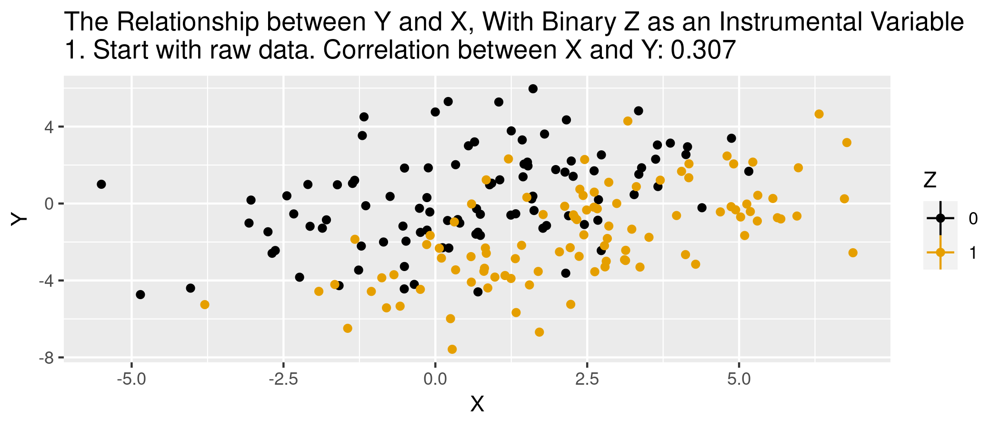

<!-- Adjust some CSS code for font size and maintain R code font size -->
<style type="text/css">
.remark-slide-content {
    font-size: 30px;
    padding: 1em 2em 1em 2em;    
}
.remark-code {
  font-size: 15px;
}
.remark-inline-code { 
    font-size: 20px;
}
</style>


<!-- Set R options for how code chunks are displayed and load packages -->
```{r setup, include=FALSE}
options(htmltools.dir.version = FALSE)
library(knitr)
knitr::opts_chunk$set(
  fig.align="center",  
  fig.height=3, #fig.width=6,
  # out.width="748px", #out.length="520.75px",
  dpi=300, #fig.path='Figs/',
  cache=T,# echo=F, warning=F, message=F
  warning = FALSE, 
  message = FALSE, 
  cache.lazy = FALSE,
  error=TRUE
  )

knitr::opts_hooks$set(fig.callout = function(options) {
  if(options$fig.callout) {
    options$echo = FALSE
  }
  options
})

if (!require("pacman")) install.packages("pacman")
pacman::p_load(tidyverse, ggplot2, dplyr, lubridate, readr, readxl, hrbrthemes,
               scales, plotly, gganimate, cobalt, ivpack, stargazer, ggthemes, here)
```

```{r xaringan-scribble, echo=FALSE}
xaringanExtra::use_scribble(rgb(0.9, 0.5, 0.5))
```


# Table of contents

1. [Smoking Literature](#smoking_lit)

2. [Cigarette Data](#smoking_data)

3. [Instrumental Variables](#IV)

4. [Estimating Demand for Cigarettes](#smoking_demand)


<!-- New Section -->
---
class: inverse, center, middle
name: smoking_lit

# Background on Cigarettes and Pricing

<html><div style='float:left'></div><hr color='#EB811B' size=1px width=1055px></html>


---
# History of Smoking

.center[
  
]

---
# History of Smoking
- Widespread smoking began in late 1800s
- Lung cancer becoming more common after 1930s
- First evidence of link in 1950s
- Surgeon general's report in 1964
- Very important in causal inference! ([Section 5.1.1](https://mixtape.scunning.com/matching-and-subclassification.html#some-background) of Causal Inference Mixtape)

---
# Why it matters
1. Extreme public health concerns
  - Lung cancer prevalence
  - Fetal and baby health
  
2. Economic questions
  - Is it an information problem?
  - Externalities (second-hand smoke)
  - Moral hazard due to insurance
  
---
# In our case
We want to focus on estimating demand for cigarettes. By this, I mean estimating price elasticity of demand.

--
<br>

We'll show that standard OLS isn't going to do this very well.

<!-- New Section -->
---
class: inverse, center, middle
name: smoking_data

# Cigarette Data

<html><div style='float:left'></div><hr color='#EB811B' size=1px width=1055px></html>


---
# The Data
```{r eval=T, include=F}
cig.data <- read_rds(here("data/TaxBurden_Data.rds"))
```
- Data from [CDC Tax Burden on Tobacco](https://data.cdc.gov/Policy/The-Tax-Burden-on-Tobacco-1970-2018/7nwe-3aj9/data)

- Visit GitHub repository for other info: [Tobacco GitHub repository](https://github.com/imccart/CDC-Tobacco)

- Supplement with CPI data, also in GitHub repo.

---
# Summary stats
We're interested in cigarette prices and sales, so let's focus our summaries on those two variables
```{r, results="asis"}
stargazer(as.data.frame(cig.data %>% select(sales_per_capita, price_cpi, cost_per_pack)), type="html")
```


---
# Cigarette Sales
```{r cig-sales, eval=FALSE, warning=FALSE}
cig.data %>% 
  ggplot(aes(x=Year,y=sales_per_capita)) + 
  stat_summary(fun.y="mean",geom="line") +
  labs(
    x="Year",
    y="Packs per Capita",
    title="Cigarette Sales"
  ) + theme_bw() +
  scale_x_continuous(breaks=seq(1970, 2020, 5))
```
.plot-callout[
```{r cig-sales-callout, ref.label="cig-sales", fig.callout=TRUE, warning=FALSE}
```
]

---
# Cigarette Sales

```{r cig-sales-output, ref.label="cig-sales", fig.callout=TRUE, warning=FALSE}
```

---
# Cigarette Prices
```{r cig-price, eval=FALSE, warning=FALSE}
cig.data %>% 
  ggplot(aes(x=Year,y=price_cpi)) + 
  stat_summary(fun.y="mean",geom="line") +
  labs(
    x="Year",
    y="Price per Pack ($)",
    title="Cigarette Prices in 2010 Real Dollars"
  ) + theme_bw() +
  scale_x_continuous(breaks=seq(1970, 2020, 5))
```
.plot-callout[
```{r cig-price-callout, ref.label="cig-price", fig.callout=TRUE, warning=FALSE}
```
]

---
# Cigarette Prices

```{r cig-price-output, ref.label="cig-price", fig.callout=TRUE, warning=FALSE}
```


<!-- New Section -->
---
class: inverse, center, middle
name: IV

# Instrumental Variables

<html><div style='float:left'></div><hr color='#EB811B' size=1px width=1055px></html>


---
# What is instrumental variables
Instrumental Variables (IV) is a way to identify causal effects using variation in treatment particpation that is due to an *exogenous* variable that is only related to the outcome through treatment.


---
# Why bother with IV?
Two reasons to consider IV:
1. Selection on unobservables
2. Reverse causation

--
<br>

Either problem is sometimes loosely referred to as *endogeneity*

---
# Simple example
- $y = \beta x + \varepsilon (x)$,<br>
where $\varepsilon(x)$ reflects the dependence between our observed variable and the error term.<br>

- Simple OLS will yield<br>
$\frac{dy}{dx} = \beta + \frac{d\varepsilon}{dx} \neq \beta$


---
# What does IV do?
- The regression we want to do: <br>
$y_{i} = \alpha + \delta W_{i} + \gamma A_{i} + \epsilon_{i}$,<br>
where $W_{i}$ is treatment (think of schooling for now) and $A_{i}$ is something like ability.

- $A_{i}$ is unobserved, so instead we run: <br>
$y_{i} = \alpha + \beta W_{i} + \epsilon_{i}$

- From this "short" regression, we don't actually estimate $\delta$. Instead, we get an estimate of<br>
$\beta = \delta + \lambda_{ws}\gamma \neq \delta$,<br>
where $\lambda_{ws}$ is the coefficient of a regression of $A_{i}$ on $W_{i}$. 

---
# Intuition
IV will recover the "long" regression without observing underlying ability<br>

--
<br>

*IF* our IV satisfies all of the necessary assumptions.

---
# More formally
- We want to estimate<br>
$E[Y_{i} | W_{i}=1] - E[Y_{i} | W_{i}=0]$

- With instrument $Z_{i}$ that satisfies relevant assumptions, we can estimate this as<br>
$E[Y_{i} | W_{i}=1] - E[Y_{i} | W_{i}=0] = \frac{E[Y_{i} | Z_{i}=1] - E[Y_{i} | Z_{i}=0]}{E[W_{i} | Z_{i}=1] - E[W_{i} | Z_{i}=0]}$

- In words, this is effect of the instrument on the outcome ("reduced form") divded by the effect of the instrument on treatment ("first stage")


---
# IVs in practice
Easy to think of in terms of randomized controlled trial...

--
<br>

 Measure    | Offered Seat | Not Offered Seat | Difference 
 ---------- | ------------ | ---------------- | ---------- 
 Score      | -0.003       | -0.358           | 0.355      
 % Enrolled | 0.787        | 0.046            | 0.741   
 Effect     |              |                  | 0.48

<br>

.footnote[
Angrist *et al.*, 2012. "Who Benefits from KIPP?" *Journal of Policy Analysis and Management*.
] 


---
# What is IV *really* doing
Think of IV as two-steps:

1. Isolate variation due to the instrument only (not due to endogenous stuff)
2. Estimate effect on outcome using only this source of variation

---
# In regression terms
Interested in estimating $\delta$ from $y_{i} = \alpha + \beta x_{i} + \delta W_{i} + \varepsilon_{i}$, but $W_{i}$ is endogenous (no pure "selection on observables").

--
<br>

<b>Step 1:</b> With instrument $Z_{i}$, we can regress $W_{i}$ on $Z_{i}$ and $x_{i}$,<br>
$W_{i} = \lambda + \theta Z_{i} + \kappa x_{i} + \nu$,<br>
and form prediction $\hat{W}_{i}$.

--
<br>

<b>Step 2:</b> Regress $y_{i}$ on $x_{i}$ and $\hat{W}_{i}$,<br>
$y_{i} = \alpha + \beta x_{i} + \delta \hat{W}_{i} + \xi_{i}$

---
# In regression terms
But in practice, *DON'T* do this in two steps. Why?

--
<br>

Because standard errors are wrong...not accounting for noise in prediction, $\hat{W}_{i}$. The appropriate fix is built into most modern stats programs.


---
# Key IV assumptions
1. *Exclusion:* Instrument is uncorrelated with the error term<br>

2. *Validity:* Instrument is correlated with the endogenous variable<br>

3. *Monotonicity:* Treatment more (less) likely for those with higher (lower) values of the instrument<br>

--
<br>

Assumptions 1 and 2 sometimes grouped into an *only through* condition.


---
# Animation for IV
```{r iv-animate, message=FALSE, warning=FALSE, include=FALSE}
df <- data.frame(Z = as.integer(1:200>100),
                 W = rnorm(200)) %>%
  mutate(X = .5+2*W +2*Z+ rnorm(200)) %>%
  mutate(Y = -X + 4*W + 1 + rnorm(200),time="1") %>%
  group_by(Z) %>%
  mutate(mean_X=mean(X),mean_Y=mean(Y),YL=NA,XL=NA) %>%
  ungroup()

#Calculate correlations
before_cor <- paste("1. Start with raw data. Correlation between X and Y: ",round(cor(df$X,df$Y),3),sep='')
afterlab <- '6. Draw a line between the points. The slope is the effect of X on Y.'

dffull <- rbind(
  #Step 1: Raw data only
  df %>% mutate(mean_X=NA,mean_Y=NA,time=before_cor),
  #Step 2: Add x-lines
  df %>% mutate(mean_Y=NA,time='2. Figure out what differences in X are explained by Z'),
  #Step 3: X de-meaned 
  df %>% mutate(X = mean_X,mean_Y=NA,time="3. Remove everything in X not explained by Z"),
  #Step 4: Remove X lines, add Y
  df %>% mutate(X = mean_X,mean_X=NA,time="4. Figure out what differences in Y are explained by Z"),
  #Step 5: Y de-meaned
  df %>% mutate(X = mean_X,Y = mean_Y,mean_X=NA,time="5. Remove everything in Y not explained by Z"),
  #Step 6: Raw demeaned data only
  df %>% mutate(X =  mean_X,Y =mean_Y,mean_X=NA,mean_Y=NA,YL=mean_Y,XL=mean_X,time=afterlab))

#Get line segments
endpts <- df %>%
  group_by(Z) %>%
  summarize(mean_X=mean(mean_X),mean_Y=mean(mean_Y))

p <- ggplot(dffull,aes(y=Y,x=X,color=as.factor(Z)))+geom_point()+
  geom_vline(aes(xintercept=mean_X,color=as.factor(Z)))+
  geom_hline(aes(yintercept=mean_Y,color=as.factor(Z)))+
  guides(color=guide_legend(title="Z"))+
  geom_segment(aes(x=ifelse(time==afterlab,endpts$mean_X[1],NA),
                   y=endpts$mean_Y[1],xend=endpts$mean_X[2],
                   yend=endpts$mean_Y[2]),size=1,color='blue')+
  scale_color_colorblind()+
  labs(title = 'The Relationship between Y and X, With Binary Z as an Instrumental Variable \n{next_state}')+
  transition_states(time,transition_length=c(6,16,6,16,6,6),state_length=c(50,22,12,22,12,50),wrap=FALSE)+
  ease_aes('sine-in-out')+
  exit_fade()+enter_fade()

anim.iv <- animate(p,nframes=175)
anim_save("iv_animate.gif",
          anim.iv,path="D:/CloudStation/Professional/Teaching Material/Emory/Econ 470 - Economics and Health Policy/04-IV-Smoking/pics")
```

.center[
  
]

---
# Simulated data
.pull-left[
```{r}
n <- 5000
b.true <- 5.25
iv.dat <- tibble(
  z = rnorm(n,0,2),
  eps = rnorm(n,0,1),
  w = (z + 1.5*eps>0.15),
  y = 2.5 + b.true*w + eps + rnorm(n,0,0.5)
)
```
]

.pull-right[
- endogenous `eps`: affects treatment and outcome
- `z` is an instrument: affects treatment but no direct effect on outcome
]

---
# Results with simulated data
Recall that the *true* treatment effect is `r b.true`
.pull-left[
```{r, echo=FALSE}
summary(lm(y~w, data=iv.dat))
```
]


.pull-right[
```{r, echo=FALSE}
summary(ivreg(y ~ w | z, data=iv.dat))
```
]

---
# Checking instrument
.pull-left[
- Check the 'first stage'
```{r, echo=FALSE}
summary(lm(w~z, data=iv.dat))
```
]

.pull-right[
- Check the 'reduced form'
```{r echo=FALSE}
summary(lm(y~z, data=iv.dat))
```
]


---
# Two-stage equivalence
```{r}
step1 <- lm(w ~ z, data=iv.dat)
w.hat <- predict(step1)
step2 <- lm(y ~ w.hat, data=iv.dat)
summary(step2)
```


<!-- New Section -->
---
class: inverse, center, middle
name: smoking_demand

# Estimating Demand for Cigarettes

<html><div style='float:left'></div><hr color='#EB811B' size=1px width=1055px></html>

---
# Naive estimate
Clearly a strong relationship between prices and sales. For example, just from OLS:
```{r echo=FALSE}
cig.data <- cig.data %>% mutate(ln_sales=log(sales_per_capita),
                                ln_price_cpi=log(price_cpi),
                                ln_price=log(cost_per_pack),
                                tax_cpi=tax_state*(218/index),
                                total_tax_cpi=tax_dollar*(218/index),                                
                                ln_state_tax=log(tax_cpi))
ols <- lm(ln_sales ~ ln_price, data=cig.data)
summary(ols)
```

---
# Is this causal?
- But is that the true demand curve?

- Aren't other things changing that tend to reduce cigarette sales?

---
# Tax as an IV
```{r cig-tax, eval=FALSE, warning=FALSE}
cig.data %>% 
  ggplot(aes(x=Year,y=total_tax_cpi)) + 
  stat_summary(fun.y="mean",geom="line") +
  labs(
    x="Year",
    y="Tax per Pack ($)",
    title="Cigarette Taxes in 2010 Real Dollars"
  ) + theme_bw() +
  scale_x_continuous(breaks=seq(1970, 2020, 5))
```

.plot-callout[
```{r cig-tax-callout, ref.label="cig-tax", fig.callout=TRUE, warning=FALSE}
```
]

---
# Tax as an IV

```{r cig-tax-output, ref.label="cig-tax", fig.callout=TRUE, warning=FALSE}
```


---
# IV Results

```{r echo=FALSE}
ivs <- ivreg(ln_sales ~ ln_price | total_tax_cpi, 
             data=cig.data)
summary(ivs)
```

---
# Two-stage equivalence
```{r}
step1 <- lm(ln_price ~ total_tax_cpi, data=cig.data)
pricehat <- predict(step1)
step2 <- lm(ln_sales ~ pricehat, data=cig.data)
summary(step2)
```


---
# Different specifications
```{r echo=FALSE, results="asis"}
ols1 <- lm(ln_sales ~ ln_price_cpi, data=cig.data)
ols2 <- lm(ln_sales ~ ln_price_cpi + factor(state), data=cig.data)
ols3 <- lm(ln_sales ~ ln_price_cpi + factor(state) + factor(Year), data=cig.data)

ivs1 <- ivreg(ln_sales ~ ln_price_cpi | total_tax_cpi, data=cig.data)
ivs2 <- ivreg(ln_sales ~ ln_price_cpi + factor(state) | 
                total_tax_cpi + factor(state), data=cig.data)
ivs3 <- ivreg(ln_sales ~ ln_price_cpi + factor(state) + factor(Year) | 
                total_tax_cpi + factor(state) + factor(Year), data=cig.data)
stargazer(ols1, ols2, ols3, ivs1, ivs2, ivs3, 
          keep=c("ln_price_cpi"), 
          type="html",
          column.labels = c("OLS","IV"),
          column.separate=c(3,3),
          keep.stat=c("n"),
          model.names=FALSE,
          dep.var.caption="",
          font.size="footnotesize",
          no.space=TRUE,
          add.lines=list(c("State FE","No","Yes","Yes","No","Yes","Yes"),
                         c("Year FE","No","No","Yes","No","No","Yes")),
          covariate.labels = "Log Price",
          dep.var.labels = "Log Sales per Capita")
```


---
# Test the IV
```{r echo=FALSE, results="asis"}
first1 <- lm(ln_price_cpi ~ total_tax_cpi, data=cig.data)
first2 <- lm(ln_price_cpi ~ total_tax_cpi + factor(state), data=cig.data)
first3 <- lm(ln_price_cpi ~ total_tax_cpi + factor(state) + factor(Year), data=cig.data)

rf1 <- lm(ln_sales ~ total_tax_cpi, data=cig.data)
rf2 <- lm(ln_sales ~ total_tax_cpi + factor(state), data=cig.data)
rf3 <- lm(ln_sales ~ total_tax_cpi + factor(state) + factor(Year), data=cig.data)


stargazer(first1, first2, first3, rf1, rf2, rf3,
          keep=c("total_tax_cpi"), 
          type="html",
          column.labels = c("First Stage","Reduced Form"),
          column.separate=c(3,3),
          keep.stat=c("n"),
          model.names=FALSE,
          dep.var.caption="",
          font.size="footnotesize",
          no.space=TRUE,
          add.lines=list(c("State FE","No","Yes","Yes","No","Yes","Yes"),
                         c("Year FE","No","No","Yes","No","No","Yes")),
          covariate.labels = "Tax per Pack",
          dep.var.labels = c("Log Price","Log Sales"))
```

---
# Summary
1. Most elasticities of around -0.25% to -0.37%

2. Much larger elasticities when including year fixed effects

3. Perhaps not too outlandish given more recent evidence: [NBER Working Paper](https://www.nber.org/papers/w22251.pdf).

---
# Some other IV issues

1. IV estimators are biased. Performance in finite samples is questionable.

2. IV estimators provide an estimate of a Local Average Treatment Effect (LATE), which is only the same as the ATT under some conditions or assumptions.

3. What about lots of instruments? The finite sample problem is more important and we may try other things (JIVE).<br>

--
<br>
The National Bureau of Economic Researh (NBER) has a great resource [here](https://www.nber.org/econometrics_minicourse_2018/2018si_methods.pdf) for understanding instruments in practice.
