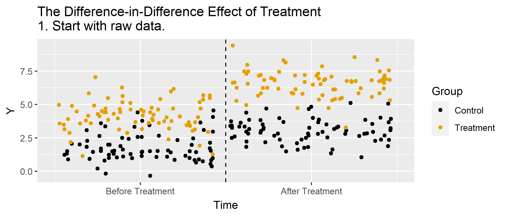

<!-- Adjust some CSS code for font size and maintain R code font size -->
<style type="text/css">
.remark-slide-content {
    font-size: 30px;
    padding: 1em 2em 1em 2em;    
}
.remark-code {
  font-size: 15px;
}
.remark-inline-code { 
    font-size: 20px;
}
</style>


<!-- Set R options for how code chunks are displayed and load packages -->
```{r setup, include=FALSE}
options(htmltools.dir.version = FALSE)
library(knitr)
knitr::opts_chunk$set(
  fig.align="center",  
  fig.height=3, #fig.width=6,
  # out.width="748px", #out.length="520.75px",
  dpi=300, #fig.path='Figs/',
  cache=T,# echo=F, warning=F, message=F
  warning = FALSE, 
  message = FALSE, 
  cache.lazy = FALSE,
  error=TRUE
  )

knitr::opts_hooks$set(fig.callout = function(options) {
  if(options$fig.callout) {
    options$echo = FALSE
  }
  options
})

if (!require("pacman")) install.packages("pacman")
pacman::p_load(tidyverse, ggplot2, dplyr, lubridate, readr, readxl, hrbrthemes,
               scales, plotly, gganimate, cobalt, ivpack, stargazer, haven, ggthemes,
               gifski, magick, lfe, dotwhisker, here)
set.seed(1234)
```

```{r xaringan-scribble, echo=FALSE}
xaringanExtra::use_scribble(rgb(0.9, 0.5, 0.5))
```


# Table of contents

1. [The Affordable Care Act](#aca)

2. [Difference-in-Differences](#dd)

3. [ACA Data](#aca_data)

4. [Medicaid Expansion and Prevalence of Health Insurance](#medicaid)


<!-- New Section -->
---
class: inverse, center, middle
name: aca

# Background on the Affordable Care Act

<html><div style='float:left'></div><hr color='#EB811B' size=1px width=1055px></html>

---
# Affordable Care Act

<br>
.center[
  
]


---
# Background

1. What percent of people are uninsured?

```{r unins, warning=FALSE, include=FALSE}
ins.dat <- read_rds(here("data/acs_medicaid.rds"))

ins.dat <- ins.dat %>%
  mutate(perc_private = (ins_employer + ins_direct)/adult_pop,
         perc_public = (ins_medicare + ins_medicaid)/adult_pop,
         perc_ins = (adult_pop - uninsured)/adult_pop,
         perc_unins = uninsured/adult_pop,
         perc_employer = ins_employer/adult_pop,
         perc_medicaid = ins_medicaid/adult_pop,
         perc_medicare = ins_medicare/adult_pop,
         perc_direct = ins_direct/adult_pop)

ins.dat %>% group_by(year) %>% summarize(mean=mean(perc_unins)) %>%
  ggplot(aes(x=year,y=mean)) + geom_line() + geom_point() + theme_bw() +
  labs(
    x="Year",
    y="Fraction Uninsured",
    title="Share of Uninsured over Time"
  ) +
  geom_vline(xintercept=2013.5, color="red")
```

--
.plot-callout[
```{r unins-plot, ref.label="unins", fig.callout=TRUE, warning=FALSE}
```
]

---
# What percent of people are uninsured?

```{r unins-plot-big, ref.label="unins", fig.callout=TRUE, warning=FALSE}
```


---
# Background

1. What percent of people are uninsured?

2. How do people get health insurance?

```{r ins-type-2012, warning=FALSE, include=FALSE}
ins.dat %>%
  filter(year==2012) %>% pivot_longer(c("perc_employer","perc_direct","perc_medicaid")) %>%
  select(State, name, value) %>%
  group_by(name) %>% summarize(mean=mean(value)) %>%
  ggplot(aes(x=name, y=mean)) +
  geom_col() + ylim(0,0.65) + 
  labs(
    x="Source of Insurance",
    y="Percent",
    title="Source of Health Insurance in 2012"
  ) + theme_bw() + scale_x_discrete(labels=c('perc_direct'='Direct Purchase',
                                             'perc_employer'='Employer-provided',
                                             'perc_medicaid'='Medicaid'))
```

--
.plot-callout[
```{r type-2012-plot, ref.label="ins-type-2012", fig.callout=TRUE, warning=FALSE}
```
]

---
# How do people get health insurance?

```{r type-2012-plot-big, ref.label="ins-type-2012", fig.callout=TRUE, warning=FALSE}
```


---
# Employer provided insurance
The U.S. still relies heavily on private insurance provided by employers. 

--
<br>
<br>
Any thoughts on why?

---
# Employer provided insurance

1. Stabalization act of 1942 (wages frozen but not benefits)

2. Tax exclusion for insurance expenditures (1954)

---
# How did the ACA change things?
<ol>
<li>Create health insurance exhanges
  <ul>
    <li>Individual mandate (since set to $0)</li>
    <li>Premium and cost-sharing subsidies (some unpaid by Trump administration)</li>
    <li>Insurance subsidies (removed before intended)</li>
    <li>Decision assistance</li>
    <li>Minimum benefits and community ratings</li>
  </ul>
</li>

<br>
<li>Stay on parent's plan to 26</li>
<ol>

---
# How did the ACA change things?
<ol start="3">

<li>Medicaid Expansion
  <ul>
    <li>Originally tied to federal funding</li>
    <li>Made voluntary by supreme court ruling</li>
    <li>Higher initial federal match rate, decreasing over time</li>
  </ul>
</li>

<br>
<li>Pay-for-performance measures
  <ul>
    <li>Hospital value-based purchasing</li>
    <li>Hospital readmission reduction</li>
    <li>Medicare Advantage quality improvement program</li>
    <li>Bundled payments and ACOs (related)</li>
  </ul>
</li>

</ol>

---
# Change in Insurance Type over Time
```{r echo=FALSE}
## Count of plans by type (across years)
mean.dat <- ins.dat %>%
  pivot_longer(c("perc_employer","perc_direct","perc_medicaid", "perc_medicare")) %>%
  select(State, name, value, year) %>%
  group_by(name, year) %>% summarize(mean=mean(value)) %>% ungroup()

mean.dat <- mean.dat %>%
  mutate(name = as.factor(name)) %>%
  mutate(name = fct_recode(name,
                           "Direct Purchase" = "perc_direct",
                           "Employer-provided" = "perc_employer",
                           "Medicaid" = "perc_medicaid",
                           "Medicare" = "perc_medicare"))

plot_ly(mean.dat,
        y=~name, 
        x=~mean, 
        frame=~as.factor(year), 
        type='bar',
        width=800,
        height=400) %>%
  animation_slider(
    currentvalue = list(prefix = "Year ", font = list(color="blue"))
  ) %>%
  layout(xaxis = list(title = "Fraction of Population"), 
         yaxis = list(title = ""))
```

---
# Main points
<ol>
  <li>Large reduction in uninsured population following ACA</li>
  <li>Biggest gains going to direct purchase (exchanges) and Medicaid (expansion)</li>
</ol>

--
<br>
<br>
But what amount of extra insurance is *due to* Medicaid expansion? In other words, who got insurance through Medicaid that wouldn't have gotten it otherwise?

---
# What does the literature say
The *Kaiser Family Foundation* has some great info on this...
<br>
- [KFF Medicaid Coverage](https://www.kff.org/medicaid/)
- [KFF Report on ACA Expansion](https://www.kff.org/medicaid/issue-brief/the-effects-of-medicaid-expansion-under-the-aca-updated-findings-from-a-literature-review-august-2019/)
- [Health Insurance and Mortality](https://www.nber.org/papers/w26533) (not what we're discussing here but still important)

<!-- New Section -->
---
class: inverse, center, middle
name: dd

# Difference-in-Differences

<html><div style='float:left'></div><hr color='#EB811B' size=1px width=1055px></html>


---
# Setup
Want to estimate $E[Y_{1}(1)- Y_{0}(1) | W=1]$

![:col_header , Post-period, Pre-period]
![:col_row Treated, $E(Y_{1}(1)|W=1)$, $E(Y_{0}(0)|W=1)$]
![:col_row Control, $E(Y_{0}(1)|W=0)$, $E(Y_{0}(0)|W=0)$]

<br>
Problem: We don't see $E[Y_{0}(1)|W=1]$


---
# Setup
![:col_header , Post-period, Pre-period]
![:col_row Treated, $E(Y_{1}(1)|W=1)$, $E(Y_{0}(0)|W=1)$]
![:col_row Control, $E(Y_{0}(1)|W=0)$, $E(Y_{0}(0)|W=0)$]

<br>
Strategy 1: Estimate $E[Y_{0}(1)|W=1]$ using $E[Y_{0}(0)|W=1]$ (before treatment outcome used to estimate post-treatment)


---
# Setup
![:col_header , Post-period, Pre-period]
![:col_row Treated, $E(Y_{1}(1)|W=1)$, $E(Y_{0}(0)|W=1)$]
![:col_row Control, $E(Y_{0}(1)|W=0)$, $E(Y_{0}(0)|W=0)$]

<br>
Strategy 2: Estimate $E[Y_{0}(1)|W=1]$ using $E[Y_{0}(1)|W=0]$ (control group used to predict outcome for treatment)


---
# Setup
![:col_header , Post-period, Pre-period]
![:col_row Treated, $E(Y_{1}(1)|W=1)$, $E(Y_{0}(0)|W=1)$]
![:col_row Control, $E(Y_{0}(1)|W=0)$, $E(Y_{0}(0)|W=0)$]

<br>
Strategy 3: DD estimate...

<br>
Estimate $E[Y_{1}(1)|W=1] - E[Y_{0}(1)|W=1]$ using $E[Y_{0}(1)|W=0] - E[Y_{0}(0)|W=0]$ (pre-post difference in control group used to predict difference for treatment group)

---
# Animations!
```{r animate, message=FALSE, warning=FALSE, include=FALSE}
df <- data.frame(Control = c(rep("Control",150),rep("Treatment",150)),
                 Time=rep(c(rep("Before",75),rep("After",75)),2)) %>%
  mutate(Y = 2+2*(Control=="Treatment")+1*(Time=="After") + 1.5*(Control=="Treatment")*(Time=="After")+rnorm(300),state="1",
         xaxisTime = (Time == "Before") + 2*(Time == "After") + (runif(300)-.5)*.95) %>%
  group_by(Control,Time) %>%
  mutate(mean_Y=mean(Y)) %>%
  ungroup()

df$Time <- factor(df$Time,levels=c("Before","After"))

#Create segments
dfseg <- df %>%
  group_by(Control,Time) %>%
  summarize(mean_Y = mean(mean_Y)) %>%
  ungroup()

diff <- filter(dfseg,Time=='After',Control=='Control')$mean_Y[1] - filter(dfseg,Time=='Before',Control=='Control')$mean_Y[1]

dffull <- rbind(
  #Step 1: Raw data only
  df %>% mutate(state='1. Start with raw data.'),
  #Step 2: Add Y-lines
  df %>% mutate(state='2. Figure out what differences in Y are explained by Treatment and/or Time.'),
  #Step 3: Collapse to means
  df %>% mutate(Y = mean_Y,state="3. Keep only what's explained by Treatment and/or Time."),
  #Step 4: Display time effect
  df %>% mutate(Y = mean_Y,state="4. See how Control changed over Time."),
  #Step 5: Shift to remove time effect
  df %>% mutate(Y = mean_Y 
                - (Time=='After')*diff,
                state="5. Remove the Before/After Control difference for both groups."),
  #Step 6: Raw demeaned data only
  df %>% mutate(Y = mean_Y 
                - (Time=='After')*diff,
                state='6. The remaining Before/After Treatment difference is the effect.'))


p <- ggplot(dffull,aes(y=Y,x=xaxisTime,color=as.factor(Control)))+geom_point()+
  guides(color=guide_legend(title="Group"))+
  geom_vline(aes(xintercept=1.5),linetype='dashed')+
  scale_color_colorblind()+
  scale_x_continuous(
    breaks = c(1, 2),
    label = c("Before Treatment", "After Treatment")
  )+xlab("Time")+
  #The four lines for the four means
  geom_segment(aes(x=ifelse(state %in% c('2. Figure out what differences in Y are explained by Treatment and/or Time.',"3. Keep only what's explained by Treatment and/or Time."),
                            .5,NA),
                   xend=1.5,y=filter(dfseg,Time=='Before',Control=='Control')$mean_Y[1],
                   yend=filter(dfseg,Time=='Before',Control=='Control')$mean_Y[1]),size=1,color='black')+
  geom_segment(aes(x=ifelse(state %in% c('2. Figure out what differences in Y are explained by Treatment and/or Time.',"3. Keep only what's explained by Treatment and/or Time."),
                            .5,NA),
                   xend=1.5,y=filter(dfseg,Time=='Before',Control=='Treatment')$mean_Y[1],
                   yend=filter(dfseg,Time=='Before',Control=='Treatment')$mean_Y[1]),size=1,color="#E69F00")+
  geom_segment(aes(x=ifelse(state %in% c('2. Figure out what differences in Y are explained by Treatment and/or Time.',"3. Keep only what's explained by Treatment and/or Time."),
                            1.5,NA),
                   xend=2.5,y=filter(dfseg,Time=='After',Control=='Control')$mean_Y[1],
                   yend=filter(dfseg,Time=='After',Control=='Control')$mean_Y[1]),size=1,color='black')+
  geom_segment(aes(x=ifelse(state %in% c('2. Figure out what differences in Y are explained by Treatment and/or Time.',"3. Keep only what's explained by Treatment and/or Time."),
                            1.5,NA),
                   xend=2.5,y=filter(dfseg,Time=='After',Control=='Treatment')$mean_Y[1],
                   yend=filter(dfseg,Time=='After',Control=='Treatment')$mean_Y[1]),size=1,color="#E69F00")+
  #Line indicating treatment effect
  geom_segment(aes(x=1.5,xend=1.5,
                   y=ifelse(state=='6. The remaining Before/After Treatment difference is the effect.',
                            filter(dfseg,Time=='After',Control=='Treatment')$mean_Y[1]-diff,NA),
                   yend=filter(dfseg,Time=='Before',Control=='Treatment')$mean_Y[1]),size=1.5,color='blue')+
  #Line indicating pre/post control difference
  geom_segment(aes(x=1.5,xend=1.5,
                   y=ifelse(state=="4. See how Control changed over Time.",
                            filter(dfseg,Time=='After',Control=='Control')$mean_Y[1],
                            ifelse(state=="5. Remove the Before/After Control difference for both groups.",
                                   filter(dfseg,Time=='Before',Control=='Control')$mean_Y[1],NA)),
                   yend=filter(dfseg,Time=='Before',Control=='Control')$mean_Y[1]),size=1.5,color='blue')+
  labs(title = 'The Difference-in-Difference Effect of Treatment \n{next_state}')+
  transition_states(state,transition_length=c(6,16,6,16,6,6),state_length=c(50,22,12,22,12,50),wrap=FALSE)+
  ease_aes('sine-in-out')+
  exit_fade()+enter_fade()

anim.p <- animate(p,nframes=150)
anim_save("dd_animate.gif",
          anim.p,path="D:/CloudStation/Professional/Teaching Material/Emory/Econ 470 - Economics and Health Policy/06-DD-ACA/pics")
```

.center[
  
]


---
# Estimation
Key identifying assumption is that of *parallel trends*

--
<br>
<br>
$$E[Y_{0}(1) - Y_{0}(0)|W=1] = E[Y_{0}(1) - Y_{0}(0)|W=0]$$

---
# Estimation
Sample means:<br>
$$\begin{align}
E[Y_{1}(1) - Y_{0}(1)|W=1] &=& \left( E[Y(1)|W=1] - E[Y(1)|W=0] \right) \\
 & & - \left( E[Y(0)|W=1] - E[Y(0)|W=0]\right)
\end{align}$$


---
# Estimation
Regression:<br>
$Y_{i} = \alpha + \beta W_{i} + \lambda 1(Post) + \delta W_{i} \times 1(Post) + \varepsilon$

<br>
![:col_header , After, Before, After - Before]
![:col_row Treated, $\alpha + \beta + \lambda + \delta$, $\alpha + \beta$, $\lambda + \delta$]
![:col_row Control, $\alpha + \lambda$, $\alpha$, $\lambda$]
![:col_row Treated - Control, $\beta + \delta$, $\beta$, $\delta$]


---
# Simulated data
```{r}
N <- 5000
dd.dat <- tibble(
  w = (runif(N, 0, 1)>0.5),
  time_pre = "pre",
  time_post = "post"
)

dd.dat <- pivot_longer(dd.dat, c("time_pre","time_post"), values_to="time") %>%
  select(w, time) %>%
  mutate(t=(time=="post"),
         y.out=1.5+3*w + 1.5*t + 6*w*t + rnorm(N*2,0,1))
```

---
# Mean differences
```{r}
dd.means <- dd.dat %>% group_by(w, t) %>% summarize(mean_y = mean(y.out))
knitr::kable(dd.means, col.names=c("Treated","Post","Mean"), format="html")
```

---
# Mean differences
In this example:
- $E[Y(1)|W=1] - E[Y(1)|W=0]$ is `r dd.means[4,3]-dd.means[2,3]`
- $E[Y(0)|W=1] - E[Y(0)|W=0]$ is `r dd.means[3,3]-dd.means[1,3]`

<br>
<br>
So the ATT is `r dd.means[4,3]-dd.means[2,3] - (dd.means[3,3]-dd.means[1,3])`


---
# Regression estimator
```{r}
dd.est <- lm(y.out ~ w + t + w*t, data=dd.dat)
summary(dd.est)
```


<!-- New Section -->
---
class: inverse, center, middle
name: aca_data

# Insurance Data and Medicaid Expansion

<html><div style='float:left'></div><hr color='#EB811B' size=1px width=1055px></html>

---
# Data sources
We'll use two main data sources here:
1. Data on which states expanded Medicaid (and when
 - Available from *Kaiser Family Foundation*
2. Data on insurance status and source of health insurance by state
 - Available from the *American Community Survey*
 - These data can be tricky to work with due to their size, but there are some handy tricks in `R`

---
# Data sources
Code and links available at the [Insurance Access GitHub repository](https://github.com/imccart/Insurance-Access)

---
# Medicaid Expansion
- Directly downloaded from KFF website
- Just a raw .csv file

---
# Insurance status and source
- Data from the American Community Survey
- CPS data also available but questions changed in 2014
- Easiest way to access ACS data is through a Census API and the `acs` package...details on the *GitHub* repo


---
# Describing the data
First let's take a look at the final dataset
```{r}
head(ins.dat %>% arrange(year, State))
```

---
# Summary stats
And now for some basic summary stats (pooling all years):
```{r, results="asis"}
stargazer(as.data.frame(ins.dat %>% select(perc_unis, perc_direct, perc_medicaid)), type="html")
```

---
# Uninsurance over time
```{r unins-plot, eval=FALSE}
ins.dat %>% group_by(year) %>% summarize(mean=mean(perc_unins)) %>%
  ggplot(aes(x=year,y=mean)) + geom_line() + geom_point() + theme_bw() +
  labs(
    x="Year",
    y="Fraction Uninsured",
    title="Share of Uninsured over Time"
  ) +
  geom_vline(xintercept=2013.5, color="red")
```

.plot-callout[
```{r unins-plot-small, ref.label="unins-plot", fig.callout=TRUE, warning=FALSE}
```
]

---
# Uninsurance over time

```{r unins-plot-big, ref.label="unins-plot", fig.callout=TRUE, warning=FALSE}
```


---
# Direct purchase over time
```{r direct-plot, eval=FALSE}
ins.dat %>% group_by(year) %>% summarize(mean=mean(perc_direct)) %>%
  ggplot(aes(x=year,y=mean)) + geom_line() + geom_point() + theme_bw() +
  labs(
    x="Year",
    y="Fraction with Direct Purchase",
    title="Share of Direct Purchase Insurance over Time"
  ) +
  geom_vline(xintercept=2013.5, color="red")
```

.plot-callout[
```{r direct-plot-small, ref.label="direct-plot", fig.callout=TRUE, warning=FALSE}
```
]

---
# Direct purchase over time

```{r direct-plot-big, ref.label="direct-plot", fig.callout=TRUE, warning=FALSE}
```


---
# Medicaid over time
```{r mcaid-plot, eval=FALSE}
ins.dat %>% group_by(year) %>% summarize(mean=mean(perc_medicaid)) %>%
  ggplot(aes(x=year,y=mean)) + geom_line() + geom_point() + theme_bw() +
  labs(
    x="Year",
    y="Fraction with Medicaid",
    title="Share of Medicaid Insurance over Time"
  ) +
  geom_vline(xintercept=2013.5, color="red")
```


.plot-callout[
```{r mcaid-plot-small, ref.label="mcaid-plot", fig.callout=TRUE, warning=FALSE}
```
]

---
# Medicaid enrollment over time

```{r mcaid-plot-big, ref.label="mcaid-plot", fig.callout=TRUE, warning=FALSE}
```


<!-- New Section -->
---
class: inverse, center, middle
name: medicaid

# Medicaid expansion and health insurance?

<html><div style='float:left'></div><hr color='#EB811B' size=1px width=1055px></html>

---
# Key issue
What is the causal effect of Medicaid expansion?
- Clearly affects insurance markets
--
- but Medicaid enrollment partially crowds out private insurance


---
# Research design
Use pre/post and expansion/non-expansion states to identify effect of Medicaid expansion:
$$y_{it} = \alpha + \beta \times 1(Post) + \gamma \times 1(Expand) + \delta \times 1(Post) \times 1(Expand) + \varepsilon$$

---
# Regression results
```{r}
ins.dat.2014 <- ins.dat %>% mutate(post = (year>=2014), treat=post*expand_ever) %>% filter(is.na(expand_year) | expand_year==2014)
dd.ins.reg <- lm(perc_unins ~ post + expand_ever + post*expand_ever, data=ins.dat.2014)
summary(dd.ins.reg)
```

---
# Checking pre-trends
First just plot seperately by group:
```{r unins-group, eval=FALSE}
ins.plot.dat <- ins.dat %>% filter(!is.na(expand_ever)) %>%
  group_by(expand_ever, year) %>% summarize(mean=mean(perc_unins))
  
ggplot(data=ins.plot.dat, aes(x=year,y=mean,group=expand_ever,linetype=expand_ever)) + 
  geom_line() + geom_point() + theme_bw() +
  geom_vline(xintercept=2013.5, color="red") +
  geom_text(data = ins.plot.dat %>% filter(year == 2016), 
            aes(label = c("Non-expansion","Expansion"),
                x = year + 1,
                y = mean)) +
  guides(linetype=FALSE) +
  labs(
    x="Year",
    y="Fraction Uninsured",
    title="Share of Uninsured over Time"
  )
```

.plot-callout[
```{r unins-group-small, ref.label="unins-group", fig.callout=TRUE, warning=FALSE}
```
]

---
# Checking pre-trends

```{r unins-group-big, ref.label="unins-group", fig.callout=TRUE, warning=FALSE}
```


---
# Event study
This is poorly named:
- In finance, even study is just an *interrupted time series*
- In economics, we usually have a treatment/control group *and* a break in time

---
# Event study
First create all of the treatment/year interactions:
```{r}
event.dat <- ins.dat.2014 %>%
  mutate(expand_2012 = expand_ever*(year==2012),
         expand_2013 = expand_ever*(year==2013),
         expand_2014 = expand_ever*(year==2014),
         expand_2015 = expand_ever*(year==2015),
         expand_2016 = expand_ever*(year==2016),
         expand_2017 = expand_ever*(year==2017),
         expand_2018 = expand_ever*(year==2018))
```

---
# Event study
Second, run regression with full set of interactions and group/year dummies:
```{r}
event.ins.reg <- lm(perc_unins ~ expand_2012 + expand_2014 + 
                      expand_2015 + expand_2016 + expand_2017 + 
                      expand_2018 + factor(year) + factor(State), data=event.dat)
point.est <- as_tibble(c(event.ins.reg$coefficients[c("expand_2012","expand_2014","expand_2015",
                                            "expand_2016","expand_2017","expand_2018")]),
                       rownames = "term")
ci.est <- as_tibble(confint(event.ins.reg)[c("expand_2012","expand_2014","expand_2015",
                                   "expand_2016","expand_2017","expand_2018"),],
                    rownames = "term")
```

---
# Event study
Third, organize results into a new dataset:
```{r}
point.est <- point.est %>% rename(estimate = value)
ci.est <- ci.est %>% rename(conf.low = `2.5 %`, conf.high = `97.5 %`)
new.row <- tibble(
  term = "expand_2013",
  estimate = 0,
  conf.low = 0,
  conf.high = 0,
  year = 2013
)

event.plot.dat <- point.est %>%
  left_join(ci.est, by=c("term")) %>%
  mutate(year = c(2012, 2014, 2015, 2016, 2017, 2018)) %>%
  bind_rows(new.row) %>%
  arrange(year)
```

---
# Event study
Finally, plot coefficients and confidence intervals
```{r es-plot, warning=FALSE, include=FALSE}
dwplot(event.plot.dat, 
       vline=geom_vline(xintercept=0, linetype=2), 
       order_vars = c("expand_2018","expand_2017","expand_2016",
                      "expand_2015","expand_2014","expand_2013",
                      "expand_2012"),
       whisker_args = list(color="black", size=1.1),
       dot_args = list(color="black")) + 
  coord_flip() + theme_bw() + theme(legend.position = "none") +
  labs(y = "Year",
       x = "Estimate and 95% CI",
       title = "Event Study Estimates for Medicaid and Uninsurance Rate") +
  scale_y_discrete(labels = c("expand_2012" = "2012", 
                              "expand_2013" = "2013",
                              "expand_2014" = "2014",
                              "expand_2015" = "2015",
                              "expand_2016" = "2016",
                              "expand_2017" = "2017",
                              "expand_2018" = "2018"))
```

.plot-callout[
```{r es-plot-small, ref.label="es-plot", fig.callout=TRUE, warning=FALSE}
```
]

---
# Event study

```{r es-plot-big, ref.label="es-plot", fig.callout=TRUE, warning=FALSE}
```


---
# Fixed Effects?

Recall our original regression specification:<br>
$y_{it} = \alpha + \beta \times 1(Post) + \gamma \times 1(Expand) + \delta \times 1(Post) \times 1(Expand) + \varepsilon$

<br>
This is a special case of a general fixed effects estimator:<br>
$y_{it} = \alpha + \delta W_{it} + \gamma_{i} + \gamma_{t} + \varepsilon$,<br>
where $\gamma_{i}$ and $\gamma_{t}$ denote a set of coefficients on state ($i$) and year ($t$) dummy variables (or fixed effects).


---
# Fixed Effects?
In R, we can estimate the fixed effects specification using the `felm` command (among others), which is part of the `lfe` package. Intuitively, the treatment dummy is now captured by $\gamma_{i}$ and the pre/post dummy is captured by $\gamma_{t}$.

--
For small datasets, we can estimate $\gamma_{i}$ and $\gamma_{t}$ directly. For large datasets, the "fixed effects" estimators will "remove" those variables by first differencing or mean differencing each variable in the regression.

---
# Equivalence
DD is just a special case of the fixed effects approach.


.pull-left[
```{r}
summary(lm(perc_unins ~ post + expand_ever + post*expand_ever, data=ins.dat.2014))
```
]

.pull-right[
```{r}
summary(felm(perc_unins ~ treat | factor(State) + factor(year), data=ins.dat.2014))
```
]